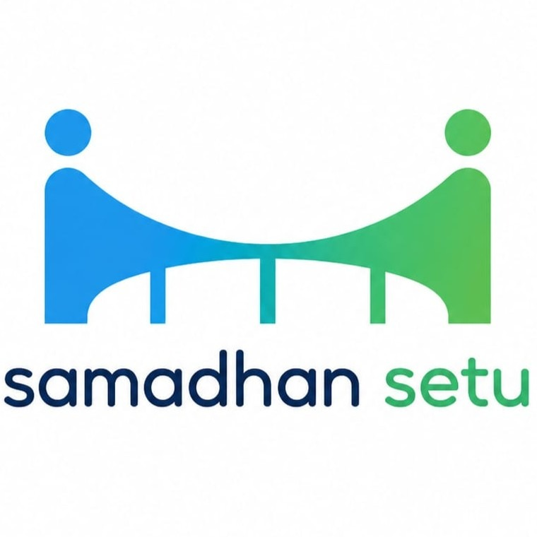
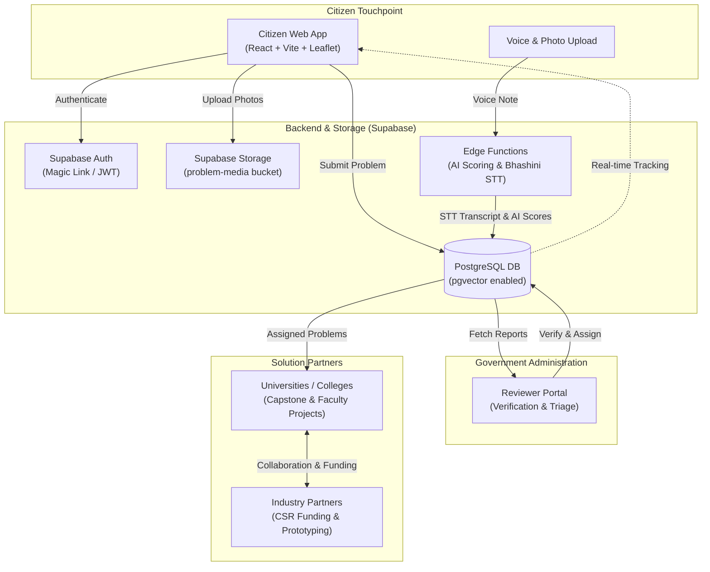
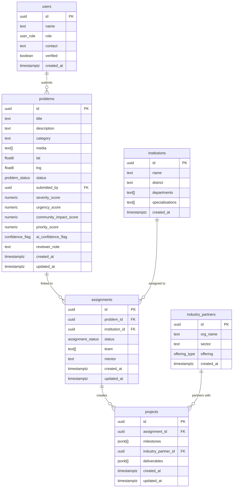

<p align="center">
  
</p>

<h1 align="center">समाधान सेतु — SamadhanSetu</h1>

<p align="center">
  <strong>Empowering Citizens, Enabling Governance, Engaging Academia & Industry.</strong><br>
  A civic problem-reporting and resolution platform tailored for Jharkhand — developed for <strong>Smart India Hackathon 2026</strong> (Problem Statement: <strong>26043</strong>).
</p>

<p align="center">
  <a href="https://react.dev/"></a>
  <a href="https://vitejs.dev/"></a>
  <a href="https://tailwindcss.com/"></a>
  <a href="https://supabase.com/"></a>
  <a href="https://leafletjs.com/"></a>
  <a href="https://www.postgresql.org/"></a>
</p>

---

## 📑 Table of Contents

- [Overview & Vision](#-overview--vision)
- [The Problem & The Solution](#-the-problem--the-solution)
- [Key Features](#-key-features)
- [System Architecture & Workflow](#-system-architecture--workflow)
- [Database Schema & Data Model](#-database-schema--data-model)
- [Tech Stack](#-tech-stack)
- [Project Directory Structure](#-project-directory-structure)
- [Local Development Setup](#-local-development-setup)
- [Environment Variables](#-environment-variables)
- [Build Phases & Roadmap](#-build-phases--roadmap)
- [Security & Row-Level Security (RLS)](#-security--row-level-security-rls)
- [Problem Categories](#-problem-categories)
- [Contributing & Team](#-contributing--team)

---

## 🌟 Overview & Vision

In many regions across India, citizen grievances (such as broken rural roads, polluted water sources, defunct healthcare facilities, or crumbling school infrastructure) suffer from a fundamental disconnect:
1. **Unidirectional Black Holes**: Citizens file complaints with no visibility into who owns the issue or how it progresses.
2. **Resource Constraints**: Local administrative bodies often face high backlogs and limited specialised engineering or research personnel.
3. **Untapped Academic & Corporate Talent**: Universities have eager engineering students seeking meaningful capstone projects, and corporations have CSR and innovation budgets looking for high-impact regional solutions.

**SamadhanSetu** bridges this gap. It provides a multi-stakeholder ecosystem where citizen reports are ingested via text or voice, analysed and prioritised using AI, vetted by government reviewers, and routed to universities and industry partners for collaborative problem-solving.

---

## 💡 The Problem & The Solution

| The Challenge | SamadhanSetu Solution |
|---|---|
| **Low Literacy & Language Barriers** | Multi-lingual support with upcoming speech-to-text voice reporting (Bhashini / Whisper). |
| **Vague & Duplicate Complaints** | AI categorization, geolocation tagging via interactive Leaflet maps, and semantic duplicate clustering with `pgvector`. |
| **Slow Triage & Prioritization** | Automated severity, urgency, and community impact scoring ($0.4 \times \text{sev} + 0.3 \times \text{urg} + 0.3 \times \text{impact}$). |
| **Lack of Accountability** | Public 5-stage tracking rail (`Submitted` ➔ `Under Review` ➔ `Assigned` ➔ `In Progress` ➔ `Resolved`). |
| **Execution Bottlenecks** | Matching vetted civic issues directly to university departments and industry CSR/mentorship programs. |

---

## 🚀 Key Features

### 👤 1. Citizen Portal
- **Passwordless Magic-Link Authentication**: Frictionless email login with zero password management hassles.
- **Rich Problem Reporting**: Form supporting issue titles, multi-paragraph descriptions, sector categorization, and photo evidence upload (up to 5 photos, max 10MB each).
- **Geospatial Pin Placement**: Interactive Leaflet map centered on Jharkhand (`[23.6102, 85.2799]`) with high-accuracy browser geolocation detection.
- **End-to-End Status Tracking**: Real-time status lookup (`/track/:problemId`) with copyable tracking IDs, category badges, dynamic 5-stage progress rail, and interactive photo evidence gallery with high-resolution preview.

### 🤖 2. AI Triage & Scoring Engine *(Phase 2+)*
- **Multi-Factor Priority Scoring**: Automatically calculates:
  - `severity_score` (0–10 scale)
  - `urgency_score` (0–10 scale)
  - `community_impact_score` (boosted by duplicate reports and neighborhood upvotes)
  - `priority_score` ($0.4 \times \text{severity} + 0.3 \times \text{urgency} + 0.3 \times \text{impact}$)
- **Automated Anomaly & Authenticity Flags**: AI flags reports as `looks genuine` or `needs verification` based on image analysis and text coherence.

### 🔍 3. Semantic Duplicate Detection *(Phase 3+)*
- Uses PostgreSQL **`pgvector`** embeddings to identify similar complaints in close geographical proximity, preventing duplicate tickets and consolidating community demand.

### 🎙️ 4. Voice & Vernacular Accessibility *(Phase 4+)*
- Direct integration with **Digital India Bhashini** for native Indic voice-to-text (Hindi, Santali, Mundari, Ho, etc.) with automated translation and fallback via Whisper.

### 🏛️ 5. Multi-Stakeholder Collaboration Portals *(Phases 5–7)*
- **Government Reviewer Portal**: Officers verify authenticity, add official notes, or return tickets for clarification.
- **University / Academic Portal**: Colleges and polytechnics browse assigned problems, build student/faculty teams, and submit project proposals.
- **Industry & CSR Portal**: Enterprises sponsor solutions, provide technical mentorship, and supply prototyping equipment.
- **Admin Analytics Dashboard**: Heatmaps of civic issues, department performance metrics, SLA tracking, and resolution rates.

---

## 🏗️ System Architecture & Workflow



---

## 🗄️ Database Schema & Data Model

The database is built on PostgreSQL inside Supabase, featuring Row Level Security (RLS), custom enum types, automated timestamp triggers, and `pgvector` extension support.



### Key Enums
- **`user_role`**: `'citizen'`, `'university'`, `'industry'`, `'admin'`
- **`problem_status`**: `'Submitted'`, `'Under Review'`, `'Assigned'`, `'In Progress'`, `'Resolved'`, `'Returned'`
- **`offering_type`**: `'mentorship'`, `'funding'`, `'prototyping'`
- **`assignment_status`**: `'pending'`, `'accepted'`, `'in_progress'`, `'completed'`
- **`confidence_flag`**: `'looks genuine'`, `'needs verification'`

---

## 🛠️ Tech Stack

### Frontend
- **Framework**: React 18 (with React Hooks and Functional Components)
- **Build Tool**: Vite 5
- **Routing**: React Router DOM v6
- **Styling**: Tailwind CSS v3 with `@tailwindcss/forms` plugin
- **Brand Colors**: Indian Saffron (`#FF9933`), India Green (`#138808`), and modern neutral slates
- **Mapping & Geolocation**: Leaflet 1.9 + React-Leaflet 4

### Backend & Cloud Services
- **Database**: Supabase PostgreSQL with `pgvector`
- **Authentication**: Supabase Auth (Passwordless OTP / Magic Links)
- **Object Storage**: Supabase Storage (`problem-media` public bucket)
- **Serverless / Edge**: Supabase Edge Functions (Deno / TypeScript)

### Future Integrations
- **AI Triage**: Google Gemini API / OpenAI API via Supabase Edge Functions
- **Speech-to-Text**: Digital India Bhashini STT API with OpenAI Whisper fallback

---

## 📂 Project Directory Structure

```text
samadhan-setu/
├── .env.example              # Template for local environment variables
├── .env.local                # Local environment secrets (gitignored)
├── CHANGELOG.md              # Detailed changelog of phases and releases
├── README.md                 # Complete project documentation
├── index.html                # Vite HTML entrypoint with Leaflet CSS links
├── package.json              # Dependencies and script definitions
├── postcss.config.js         # PostCSS configuration for Tailwind
├── tailwind.config.js        # Tailwind configuration (custom colors & plugins)
├── vite.config.js            # Vite build configuration
├── public/                   # Static assets
├── src/
│   ├── main.jsx              # React app entry point
│   ├── App.jsx               # Top-level router with ProtectedRoute wrapper
│   ├── index.css             # Tailwind base, components, and utilities
│   ├── components/
│   │   ├── Navbar.jsx        # Responsive navigation with auth actions & brand logo
│   │   ├── MapPicker.jsx     # Leaflet map picker with custom markers & geolocation
│   │   └── StatusRail.jsx    # 5-step visual problem lifecycle progress rail
│   ├── context/
│   │   └── AuthContext.jsx   # Global Supabase authentication session state
│   ├── lib/
│   │   └── supabaseClient.js # Singleton client instance for Supabase interactions
│   └── pages/
│       ├── Landing.jsx       # Hero, feature highlights, and category overview
│       ├── Login.jsx         # Passwordless magic-link authentication screen
│       ├── Submit.jsx        # Problem submission form with photo upload & map
│       ├── Track.jsx         # Report details and real-time status tracker
│       └── ComingSoon.jsx    # Clean fallback component for upcoming phases
└── supabase/
    └── migrations/
        └── 0001_initial_schema.sql  # Full 6-table relational schema, triggers & RLS
```

---

## 💻 Local Development Setup

Follow these instructions to run SamadhanSetu on your local machine.

### Prerequisites
- **Node.js**: `18.0.0` or higher
- **npm**: `9.0.0` or higher
- A free **[Supabase](https://supabase.com)** account and active project

---

### Step 1: Clone the Repository

```bash
git clone https://github.com/your-username/samadhan-setu.git
cd samadhan-setu
```

### Step 2: Install Node Dependencies

```bash
npm install
```

### Step 3: Configure Supabase Database & Storage

1. Navigate to your **Supabase Project Dashboard**.
2. **Enable pgvector**:
   - Go to **Database** ➔ **Extensions**.
   - Search for `vector` and toggle it **ON**.
3. **Execute Database Migration**:
   - Go to the **SQL Editor** in Supabase.
   - Open [supabase/migrations/0001_initial_schema.sql](supabase/migrations/0001_initial_schema.sql).
   - Copy the entire SQL content, paste it into the editor, and click **Run**.
4. **Create Media Storage Bucket**:
   - Go to **Storage** ➔ **New Bucket**.
   - Set the bucket name to: `problem-media`
   - Mark the bucket as **Public** (so uploaded media can be viewed on tracking cards).
   - Save the bucket.

### Step 4: Configure Supabase Auth Redirect URLs

1. In Supabase, go to **Authentication** ➔ **URL Configuration**.
2. Set **Site URL** to:
   ```text
   http://localhost:5173
   ```
3. Under **Redirect URLs**, add:
   ```text
   http://localhost:5173/**
   ```

### Step 5: Setup Environment Variables

Copy `.env.example` to `.env.local`:

```bash
cp .env.example .env.local
```

Open `.env.local` and paste your project keys from **Supabase Dashboard** ➔ **Project Settings** ➔ **API**:

```env
VITE_SUPABASE_URL=https://your-project-id.supabase.co
VITE_SUPABASE_ANON_KEY=your-supabase-anon-key-here
```

### Step 6: Launch Development Server

```bash
npm run dev
```

Open your browser and navigate to **`http://localhost:5173`**.

---

## 🔐 Environment Variables

| Variable | Scope | Target Phase | Description |
|---|---|---|---|
| `VITE_SUPABASE_URL` | Client (`.env.local`) | Phase 1+ | Supabase Project REST API URL |
| `VITE_SUPABASE_ANON_KEY` | Client (`.env.local`) | Phase 1+ | Supabase Public Anonymous API Key |
| `LLM_API_KEY` | Edge Function Secret | Phase 2+ | API key for AI scoring & categorization (Never expose with `VITE_`) |
| `BHASHINI_API_KEY` | Edge Function Secret | Phase 4+ | Digital India Bhashini Speech-to-Text API Key |
| `WHISPER_API_KEY` | Edge Function Secret | Phase 4+ | OpenAI Whisper fallback transcription API Key |

---

## 🗺️ Build Phases & Roadmap

| Phase | Milestone | Deliverables | Status |
|:---:|---|---|:---:|
| **1** | **Citizen Portal (Text & Media Reporting)** | Vite scaffold, magic-link auth, Leaflet map picker, photo uploads to Supabase Storage, problem submission, and `/track/:id` progress rail with evidence viewer. | ✅ Complete & Verified |
| **2** | **AI Triage & Prioritization** | Supabase Edge Function to analyze problem submissions and populate severity, urgency, and priority scores. | ⏳ Planned |
| **3** | **Duplicate Detection & Community Upvotes** | `pgvector` semantic text embeddings to match near-identical local complaints and let citizens confirm them. | ⏳ Planned |
| **4** | **Voice & Multilingual Reporting** | Bhashini voice recorder component supporting Indic regional dialects with audio transcription. | ⏳ Planned |
| **5** | **Government Reviewer Portal** | Officer dashboard for problem verification, department assignment, and return-for-evidence workflows. | ⏳ Planned |
| **6** | **University & Industry Portals** | Matchmaking system for colleges to adopt problems as capstone projects with industry CSR sponsorship. | ⏳ Planned |
| **7** | **Admin Analytics & Heatmaps** | District-level problem density heatmaps, SLA tracking, and resolution analytics. | ⏳ Planned |
| **8** | **Production Deployment & Polish** | CI/CD pipeline, PWA offline caching, automated E2E testing, and production deployment on Vercel/Netlify. | ⏳ Planned |

---

## 🔒 Security & Row-Level Security (RLS)

SamadhanSetu enforces strict security at the database layer using PostgreSQL RLS:
- **`public.users`**: Users can only read and update their own profile records (`auth.uid() = id`).
- **`public.problems`**: 
  - Authenticated citizens can insert issues where `submitted_by = auth.uid()`.
  - In Phase 1, citizens can query their own submitted issues.
  - Reviewer and administrative access policies are activated in Phase 5.
- **`institutions` & `assignments`**: Locked to unauthorized client queries until Phase 5 role-based policies are attached.
- **`industry_partners` & `projects`**: Protected until Phase 6 industry authentication policies are defined.

---

## 🏷️ Problem Categories

1. 🛣️ **Infrastructure / Roads**: Potholes, broken bridges, unpaved rural roads, streetlights.
2. 💧 **Water & Sanitation**: Contaminated drinking water, dry borewells, open drainage, garbage dumps.
3. 🏥 **Health**: Primary health centre staff absence, lack of medicines, ambulance delays.
4. 📚 **Education**: Damaged school classrooms, lack of toilets in schools, teacher shortages.
5. 🌾 **Agriculture**: Canal irrigation blockages, cold-storage unavailability, damaged mandi sheds.

---

## 🤝 Contributing & Team

Developed for the **Smart India Hackathon 2026** under Problem Statement **26043**.

1. Fork the project repository.
2. Create your feature branch (`git checkout -b feature/phase-2-ai-scoring`).
3. Commit your changes with clear messages (`git commit -m 'feat: add ai scoring edge function'`).
4. Push to the branch (`git push origin feature/phase-2-ai-scoring`).
5. Open a Pull Request.

---

## 📄 License

This project is licensed under the [MIT License](LICENSE).
